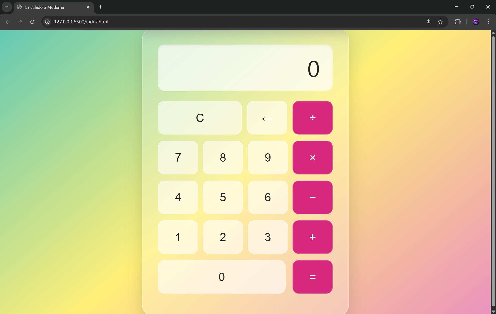

🧮 Calculadora Glassmorphism
Una calculadora web elegante y funcional construida con HTML5, CSS3 y JavaScript vanilla. El diseño destaca por su estética moderna de "vidrio esmerilado" (Glassmorphism) lograda mediante transparencias y filtros de desenfoque.

🚀 Características
Diseño Moderno: Interfaz basada en la tendencia Glassmorphism con degradados vibrantes y efectos de desenfoque (backdrop-filter).

Totalmente Responsiva: Se adapta a diferentes tamaños de pantalla manteniendo su estructura.

Operaciones Básicas: Suma, resta, multiplicación y división.

Funciones Especiales:

Botón de limpieza total (C).

Botón de retroceso/borrado carácter por carácter (←).

Interacción Fluida: Feedback visual al pasar el ratón (hover) y al hacer clic (active) en los botones.

🛠️ Tecnologías utilizadas
HTML5: Estructura semántica.

CSS3: Estilos avanzados, Flexbox y efectos de transparencia.

JavaScript: Lógica de procesamiento de datos y manipulación del DOM.

📂 Estructura del Proyecto
Plaintext
├── index.html   # Estructura de la calculadora
├── style.css    # Estilos y diseño visual
└── script.js    # Lógica de funcionamiento
💻 Instalación y Uso
No requiere dependencias externas ni compiladores. Para ver el proyecto en funcionamiento:

Clona este repositorio o descarga los archivos.

Abre el archivo index.html en tu navegador preferido.

📖 Cómo funciona la lógica
El script utiliza un sistema de buffer para manejar lo que el usuario ve en pantalla antes de procesar las operaciones matemáticas:

totalAcumulado: Almacena el resultado de las operaciones anteriores.

pantalla: Es el valor actual (en cadena de texto) que el usuario está escribiendo.

ultimoOperador: Guarda el símbolo de la operación pendiente por realizar.

📸 Captura del Proyecto

🌐 Sitio Web
https://calculator-app-zeta-ruddy.vercel.app/
